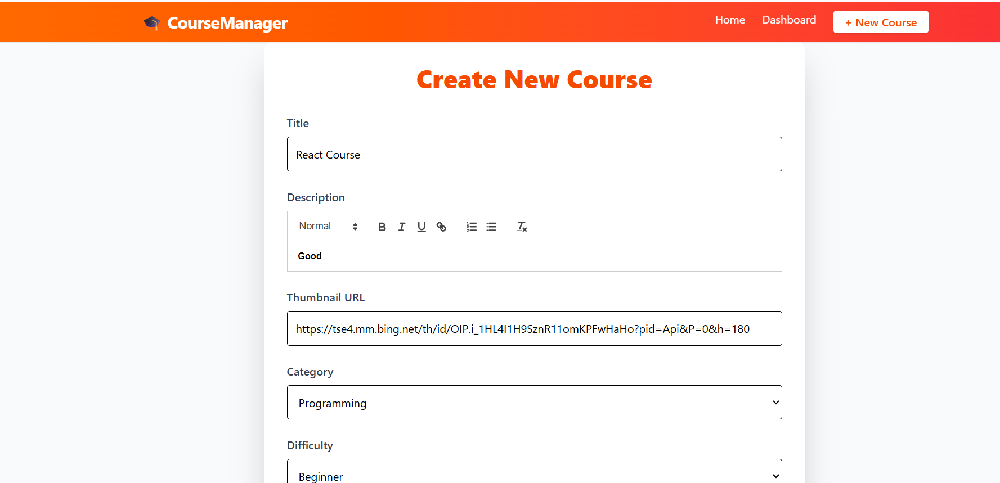
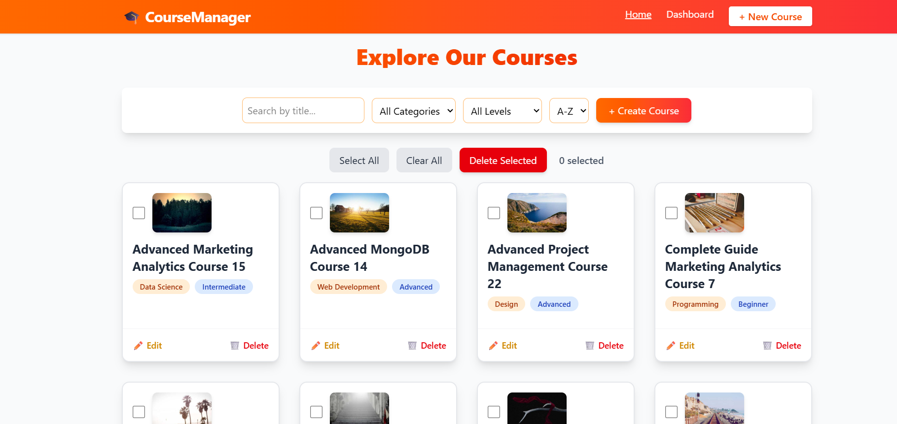
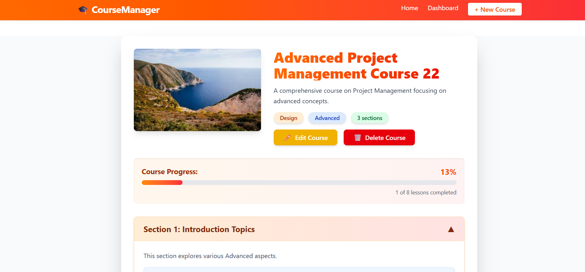

# 🎓 Course Management System (Techjays Internship Assignment)

This is a frontend-focused **Course Management System** built as part of the Techjays internship program. It allows users to create, manage, view, and track educational courses with sections and lessons using a rich UI experience.

---

## 🚀 Features Implemented

### 🧩 Sprint 1: Project Setup & Course Creation
- Project initialized using **Vite + React**
- React Router configured for navigation
- Redux Toolkit setup with slices for course, section, lesson
- Form to add:
  - Title (10–60 characters)
  - Description (with rich text editor – Quill.js)
  - Category (e.g., Programming, Design)
  - Difficulty (Beginner/Intermediate/Advanced)
  - Multiple sections & lessons (nested structure)
- Data stored using **LocalStorage**

### 📋 Sprint 2: Course Listing & Management
- Course list page with:
  - Thumbnail, title, category, difficulty
  - Pagination (10 per page)
  - Search and filter by category/difficulty
  - Sorting options (A-Z, Z-A)
  - Edit/Delete actions with confirmation

### 📚 Sprint 3: Course Details & Lesson View
- Course detail view with:
  - Expandable section list
  - Lessons under each section
  - Lesson content rendered as rich HTML
  - Progress tracking with "Mark as Complete"
  - Auto-save progress to localStorage

### 📊 Sprint 4: Dashboard & Final Polish
- Dashboard with:
  - Total courses count
  - Course distribution by category (Pie Chart – **Recharts**)
  - Completion analytics
  - "Create New Course" quick button
- Responsive design using **Tailwind CSS**
- Lazy loading for routes, optimized re-renders

--- 

## 🛠 Tech Stack

| Area | Tech Used |
|------|-----------|
| Framework | React.js |
| Styling | Tailwind CSS |
| State Management | Redux Toolkit |
| Routing | React Router DOM |
| Rich Text | React Quill + DOMPurify |
| Charts | Recharts |
| Build Tool | Vite |
| Storage | localStorage |

---

## 💻 How to Run Locally

### 🔧 Setup
1. Clone the repository  
   `git clone https://github.com/Mathan-j/course-management-system1.git`

2. Install dependencies  
   `npm install`

3. Start the dev server  
   `npm run dev`

4. Open `http://localhost:5173` in your browser

> Note: This app uses `localStorage`. Your added data will persist locally only.

---
## 📚 seed Data
[seedData](seedData.doc)
This will generate 20–40 random courses with sections and lessons, and store them in `localStorage`.  
It helps preview the full app functionality instantly without manually creating courses.

```js
// In browser console:
seedToLocalStorage();

## 📸 Screenshots

 
 
 

---

## 📦 Deployment

**Live Preview :
https://coursemanagementsystem-mathan.netlify.app/

---

 

